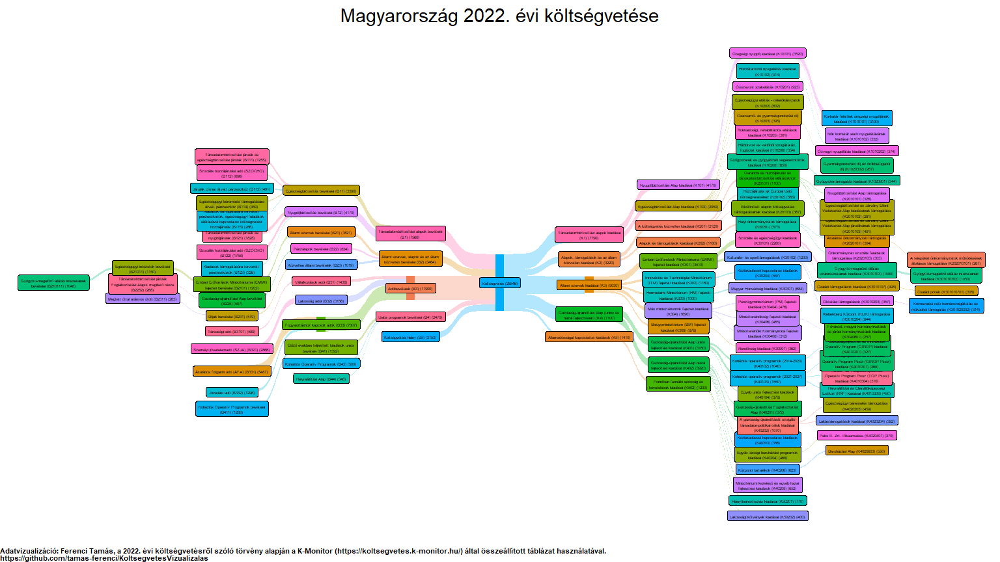

A magyar költségvetés vizualizálása
================
Ferenci Tamás

## Bevezető gondolatok

Az állam központi költségvetésének összetétele, mind a bevételi, mind a
kiadási oldalon, alapvetően határozza meg az állampolgárok életét. Éppen
ezért mindenkinek elemi érdeke, és a külső kontroll jelentette
visszacsatolás révén a jó kormányzásnak is alapja, hogy az
állampolgárok, a sajtó, a kutatók a legpontosabb képet tudják kapni
arról, hogy országuk mire költi a pénzt, és ezt milyen bevételekből
fedezi. (Annál is inkább, mert ezeket jórészt maguk az állampolgárok
fizetik be, úgyhogy eleve is helyesebb lett volna úgy fogalmazni, hogy
mire költi a pénzüket.) Fontos, hogy mindez közérthető, bárki számára
hozzáférhető, gyorsan áttekinthető formában is rendelkezésre álljon.

Magyarország költségvetésről szóló nyilvános adatközlése ennek a
szempontnak minimálisan felel meg, sőt, már a költségvetés számainak
kigyűjtése sem könnyű feladat; erről érdemes ezt az olvasmányos,
részletes – és egyben elég sokkoló –
[tanulmányt](https://drive.google.com/file/d/1jFdVf9R1cPLt4F3IDmvDG6uOHtzo3pWX/view)
elolvasni. Szerencsére a K-Monitor nevű civil szervezet, [nagyon komoly
munkával](https://k.blog.hu/2021/12/02/a_koltsegvetesi_torveny_egy_mese_most_elmeseljuk),
de összeállított egy gépi úton feldolgozható
[adatbázist](https://koltsegvetes.k-monitor.hu/). Ez alapján már
tehetünk a fenti cél érdekében. Sokszor ilyenre a legjobb egy
megfelelően választott adatvizualizáció, márpedig ezt lehetővé teszi a
fenti adatbázis.

## A 2022. évi magyar költségvetés vizualizálása

A legcélszerűbb megoldás szerintem az ún.
[Sankey-diagram](https://en.wikipedia.org/wiki/Sankey_diagram), ami
jelen esetben annyira egyértelmű, hogy szinte magyarázatot sem igényel.
Eredetileg mennyiségek áramlásának vizualizálására találták ki, de itt
is kitűnően működik (a költségvetés csakugyan felfogható úgy, mint amibe
beáramlanak a bevételek, és amiből kiáramlanak a kiadások).

Az eredmény lent megtekinthető, de ilyen kis méretben nem igen látszik
rajta semmi; célszerű nagy méretben megnézni, akár
[PNG](https://github.com/tamas-ferenci/KoltsegvetesVizualizalas/raw/main/MagyarKoltsegvetes2022.png),
akár
[PDF](https://github.com/tamas-ferenci/KoltsegvetesVizualizalas/raw/main/MagyarKoltsegvetes2022.pdf)
formátumban. A feltüntetett számok milliárd forintban értendőek. Hogy az
ábra áttekinthető legyen, csak az 250 milliárd forintnál nagyobb tételek
látszódnak.

Íme az eredmény:

<!-- -->

## Technikai megjegyzések

A K-Monitor által [elérhetővé
tett](https://koltsegvetes.k-monitor.hu/budget.xlsx) Excel-fájl egyetlen
komoly baja, hogy a hierarchia nincs szemantikusan jelölve; szerencsére
a kódszám alapján ezt elég izzadságos munkával ugyan, de ki lehet
találni.

A vizualizációt [`R`](https://www.r-project.org/) nyelven, a
[`ggsankey`](https://github.com/davidsjoberg/ggsankey) csomag
használatával végeztem, ami a jól ismert
[`ggplot2`](https://ggplot2.tidyverse.org/)-t egészíti ki.

A vizualizációt megvalósító kódom bárki számára
[elérhető](https://github.com/tamas-ferenci/KoltsegvetesVizualizalas/blob/main/README.Rmd).
